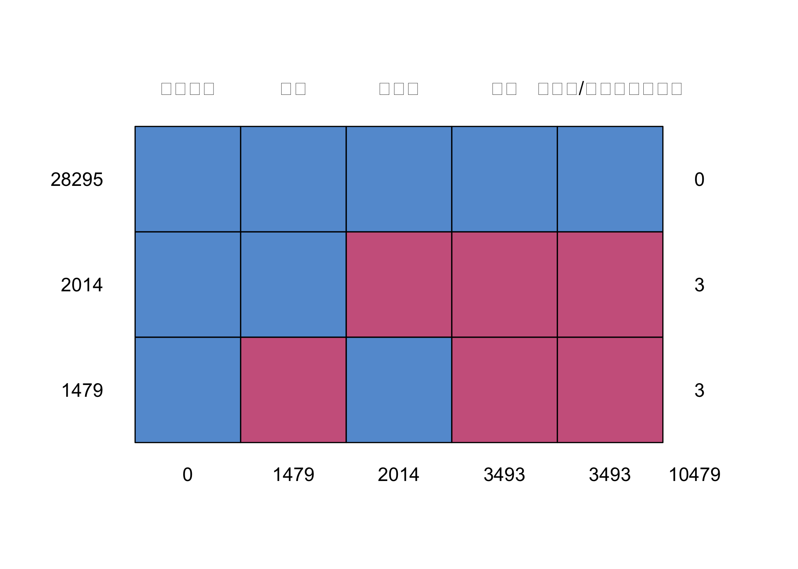

<html>
<style> 
div.bgm { background-color:#e6fff0; border-radius: 7px; padding: 10px;} 
.ans {
  color: purple;
  font-weight: bold;
}
#main { 
    color: #2cb061; 
}
</style>

<div class = "bgm">

<ul id="main">


## Data preview


## 一、	请问这三个人的眼睛是什么颜色的，要求给出推理过程。


<span style="font-size:16px;color:#8B30BB;">*Ans:*第二天自杀的两位是绿色（G），第三天自杀的是黄色（Y）。</span>

<span style="font-size:16px;color:#8B30BB;">*Ans:*推理过程：假设三个人分别叫A B C，第一天三个人都没自杀，说明他们三个人都不能确定自己的身份, 鉴于必须至少有一个绿色（G），那么组合如下：</span>

| A | B | C |
| - | - | - |
| Y | G | G |
| G | G | Y |
| G | Y | G |
| G | G | G |

<span style="font-size:16px;color:#8B30BB;">*Ans:*第一天某两个人眼中所见为一黄一绿（设：A B），剩余一人所见为两绿（设：C）。不确定绿色有2人还是3人，所以他们不敢自杀。第二天发现没有人死以后，他们推断出了这一种组合方式。因此A B明白：自己就是绿色的！因为如果自己是黄色，那对方应该第一天就发现另外两人是黄色而自杀。所以第二日AB自杀，自报绿色。第三天C自杀，因为AB敢于自杀，推断出AB眼中所见一直是一黄一绿。
<br />


---

## 二、	请二选一作答

1、	如果不受限制，你希望做什么样的游戏，为什么值得做这个游戏？ 

<span style="font-size:16px;color:#8B30BB;">*Ans:*做更好的VR游戏，身临其境的开放式世界，如GTA5，cyberpunk2077，给人类一个新世界！像黑镜中的世界一样，人类或许可以因此获得永生的机会，又或许就像elon mask 一样，开辟“火星”，新的家园。</span>

<br />

---

## 三、	请按照附件excel中的数据分析（请见附件）ABC三个当中（按照毛收入/成本（利润率）列，降序排列）我们采用哪种投入方案，性价比最高？ 给出理由。（开放式，必答题）

<!-- -->

```
      产品代码 成本 毛收入 利润 毛收入/成本（利润率）      
28295        1    1      1    1                     1     0
2014         1    1      0    0                     0     3
1479         1    0      1    0                     0     3
             0 1479   2014 3493                  3493 10479
```

#### sort data in decreasing order.


```r
data = data[order(data$`毛收入/成本（利润率）`, decreasing = T), ]
```

#### remove NAs in `毛收入/成本（利润率）`


```r
data_nna = data[-which(is.na(data$`毛收入/成本（利润率）`) == T), ]
```


```r
data = data_nna
data_nna = data_nna[order(data_nna$利润, decreasing = T), ]
```
#### solve


```r
total_sale = sum(data_nna$利润)
c(total_sale * 0.7, total_sale * 0.8, total_sale * 0.925)
```

```
[1] 11286160 12898468 14913854
```

```r
out_a = for (i in 1:dim(data_nna)[1]) {
    if (sum(data_nna[1:i, ]$利润) >= total_sale * 0.7) {
        print(i)
        break
    }
}
```

```
[1] 197
```


```r
out_a2 = sum(data_nna[1:197, ]$利润)
out_a3 = sum(data_nna[1:197, ]$成本)/sum(data_nna$成本)
out_a4 = sum(data_nna[1:197, ]$毛收入)/sum(data_nna$成本)
```


<span style="font-size:16px;color:#8B30BB;">*Ans:* A方案产品一共197个, 利润总额11289488, 成本占比0.55697, 总体利润率5.27993</span>


```r
out_b = for (i in 1:dim(data_nna)[1]) {
    if (sum(data_nna[1:i, ]$利润) >= total_sale * 0.8) {
        print(i)
        break
    }
}
```

```
[1] 381
```


```r
out_b2 = sum(data_nna[1:381, ]$利润)
out_b3 = sum(data_nna[1:381, ]$成本)/sum(data_nna$成本)
out_b4 = sum(data_nna[1:381, ]$毛收入)/sum(data_nna$成本)
```


<span style="font-size:16px;color:#8B30BB;">*Ans:* B方案产品一共381个, 利润总额12902319, 成本占比0.67366,总体利润率6.07134</span>


```r
for (i in 1:dim(data_nna)[1]) {
    if (sum(data_nna[1:i, ]$利润) >= total_sale * 0.925) {
        print(i)
        break
    }
}
```

```
[1] 1288
```


```r
out_c2 = sum(data_nna[1:1288, ]$利润)
out_c3 = sum(data_nna[1:1288, ]$成本)/sum(data_nna$成本)
out_c4 = sum(data_nna[1:1288, ]$毛收入)/sum(data_nna$成本)
```

<span style="font-size:16px;color:#8B30BB;">*Ans:*C方案产品一共1288个, 利润总额14914188, 成本占比0.85155,总体利润率7.0909</span>

<span style="font-size:16px;color:#8B30BB;">*Ans:* 选择方案C, 总体利润率最高</span>

<br />

---

## 四、	某电商平台主要面向的用户群为女性白领，最近7天销售金额如下表

<span style="font-size:16px;color:#8B30BB;">*Ans:* 工作日销售量更多。原因有：1、可能产品广告投放在工作用的app或者网页中，或者通勤路线上。2、类似于外卖，下午茶，咖啡，功能饮料，对工作有所帮助或者能增添工作时期虚荣心的产品。3、会议设备等工作相关的必需品租赁。改进计划：增添其他渠道的广告投放，坐在家里也要看到我们的产品；通过社交软件进行宣传，提升虚拟价值，让白领在家也有所炫耀；推出风险对冲产品，上班喝咖啡，周末在家买花茶，燕窝护肤缓解疲劳 etc。</span>

<br />
